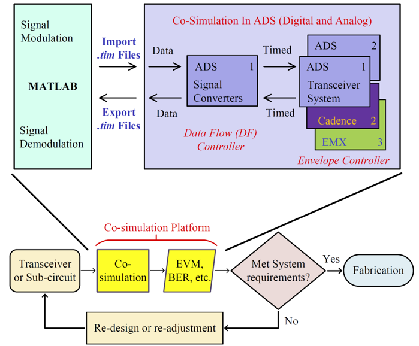
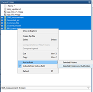
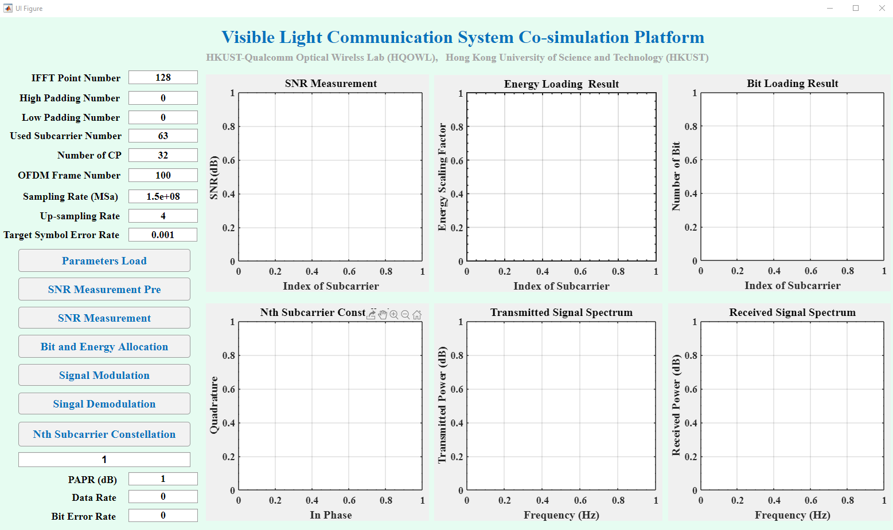
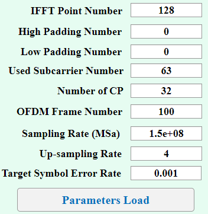
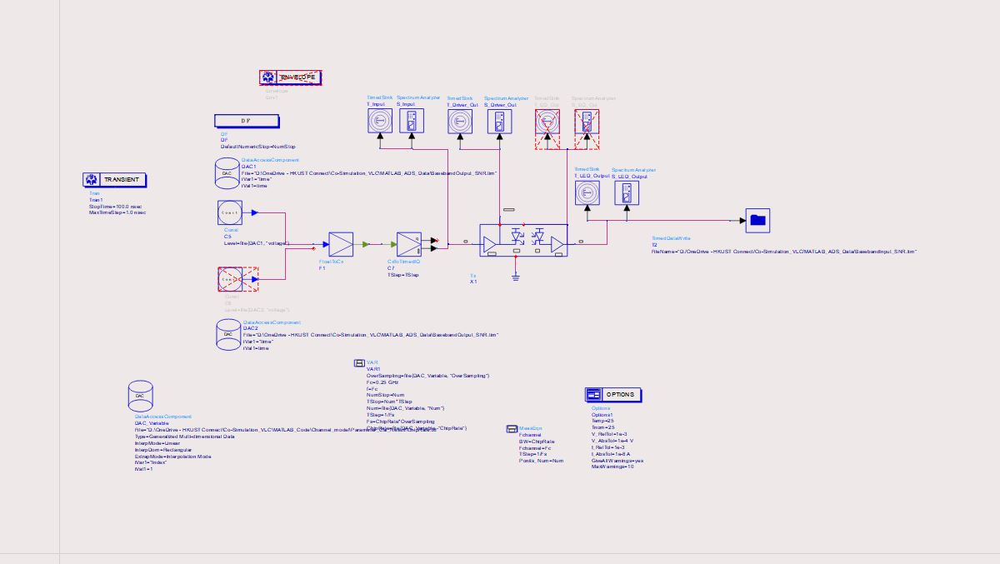
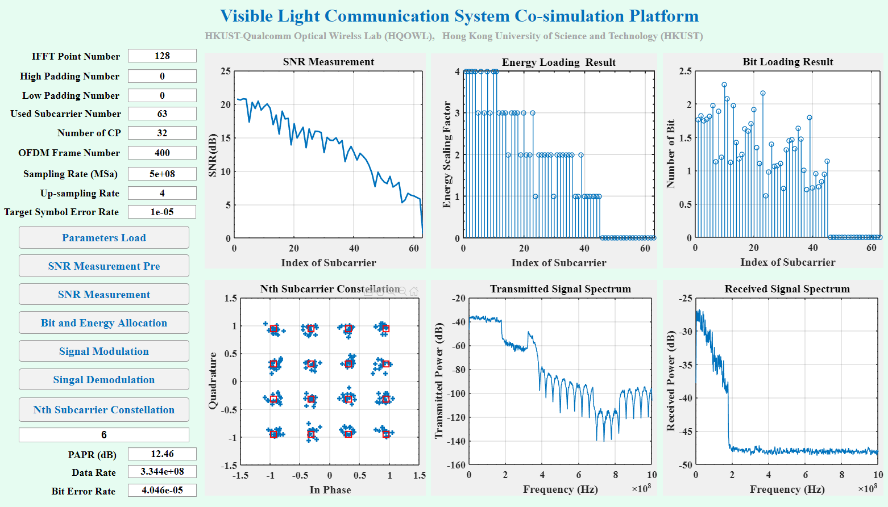

# Visible Light Communication System Co-Simulation Platform
## 1 Introduction and Motivation
#Visible light communication is becoming the trending of the short range wireless communication because license free spetrum, high data transmission capacity, security and illuination in the same time. There are many researches on VLC including devices, circuit, algorithm and so on. But we do not have a platform which can evaluate the performance of the VLC design in system level. This platform combines the MATLAB Cadence and ADS to solve this problem. 
#MATLAB is used to simulate the baseband part of the system. The DCO-OFDM with BEA is used in the baseband. The singal to noise ratio (SNR) of each subcarrier can be measurement in the co-simulation platform. The measurement result is used for adaptive bit and energy allocation. The Levin-Campello's rate adaptive (LCRA) algorithm is used. Then the DCO-OFDM signal with BAE can be generated. 
#The generated signal can be transmitted to ADS or cadence as the input of the frontend circuit. Then the simulation result from ADS or cadence is returned to MATLAB again for decoding and demodulation. The constellation, signal spectrum and waveform in time domain from both transmitter and receiver can be obtained. And the peak to average power ratio, bit error rate can be calculated automatically by the simulator. The structure and the usage of the simulator is shown below.

## 2 Enviroment Requirement
* MATLAB 2019b or later
* ADS 2019 or later
* Cadence (Optional)： The license for Cadence & ADS dynamic link is needed to support.

## 3 Project Structure

CO-SIMULATION_VLC 
|-Cosimulation_TRx_wrk 
#|-EQ: equalizer circuit design 
#|-LED_Model: RC model of the LED used for transmission 
#|-TIA_Model: model of photo detector and transimpedence amplifier 
#|-Tx: transciver frontend without equalizer 
#|-System_TEST: simulation enviroment of the tranceiver 
|-MATLAB_ADS_Data: This file is used store the files generated by MATLAB and ADS 
|-MATLAB_Code 
#|-BEA_transceiver: The souce code of the baseband and bit and energy allocation 
#|-Channel_model :  equation based channel model using with the frequency response of the LED, non-linear relationship between the forward current and the luminous flux, spectral luminous efficiency, normalized spectrum distribution as well as responsivity of the photo diode.
#|-Measurement_Result 
#|-Parameter_Cal_Result: the shared parameters between each module 
#|-Common_file: the souce code used both for transmitter and receiver 
#|-Generated_pic: the simulated result generated by the MATLAB 
#|-Received_Constellation: the constellation of each subcarrier in the transmitter 
#|-Transmitted_Constellation: the constellation of each subcarrier in the receiver 
#|-SNR_measurement: the source code for SNR measurement 
#|-Picture: The picuted used the readme.md files 

## Tutorial for the Co-Simulation Platform

1. Download the zip file and unzip or git clone the whole project to a specific location. 

2. Open the MATLAB and locate the working path of MATLAB to "your_project_location\Co-Simulation_VLC\MATLAB_Code". "your_project_location" is the path your store the downloaded project. e.g. "D:/OneDriver - HKUST Connect" is my project location.
Then adding all the folers and subfolders into the work path.

 <strong>Note: this step is very important. There are many errors if you do not operate as the guidence because MATLAB cannot find the souce files</strong>

3. Then run the app_GUI.mlapp to open the GUI of the platform. 

4. Fill the parameters of the baseband and click "Parameter Load" button to load the globle parameters.

5. Click the "SNR Measurement Pre" button to generate the transmitted signal for SNR measurement. The modulation scheme of each subcarrier is QAM-4 and the energy scaling factor is 1.

6. Open the ADS software and locate the workspace we provided. And then open the schematic of "System_TEST". 

7. Locating the path of input file to "your_project_location\Co-Simulation_VLC\MATLAB_ADS_Data\BasebandOutput_SNR"  and the path of  output file to "your_project_location\Co-Simulation_VLC\MATLAB_ADS_Data\BasebandInput_SNR". And locate the DAC_Varible location to "your_project_location\Co-Simulation_VLC\MATLAB_Code\Channel_model\Parameter_Cal_Result\ChipRate.txt"

8. Run the ADS simulation. 

9. After the ADS simulation is done. Go back to GUI and click "SNR measurement" and get the measured SNR result.

10.  Cick "Bit and Energy Allocation" to get the allocated result of the allocation.

11.  Cick "Signal Modulation" to generate the transmitted signal.

12.  Go back to the ADS project. Locate the path of input file to "your_project_location\Co-Simulation_VLC\MATLAB_ADS_Data\BasebandOutput"  and the path of  output file to "your_project_location\Co-Simulation_VLC\MATLAB_ADS_Data\BasebandInput" and run the ADS simulation again.

13.  Go back to GUI and click "Signal Demodulation". Then the received constellation, bit error rate and calculated data rate is shown. The simulated result is shown like the below picture.

14.  Evaluate and verify your system with adding your channel model and transceiver circuits.

For more information, please contact us at tminaa@connect.ust.hk
